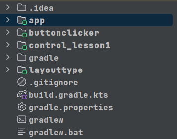
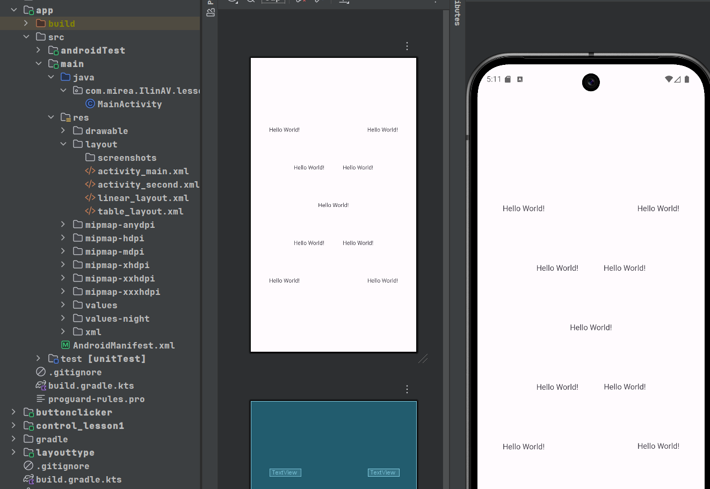
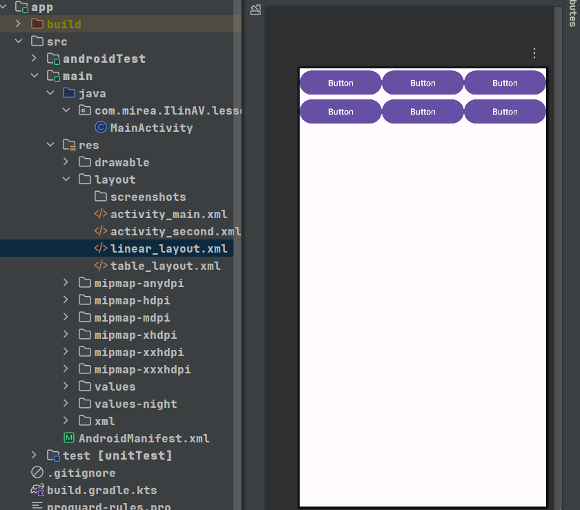
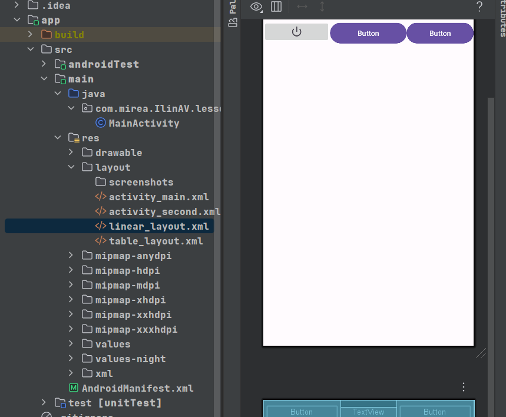
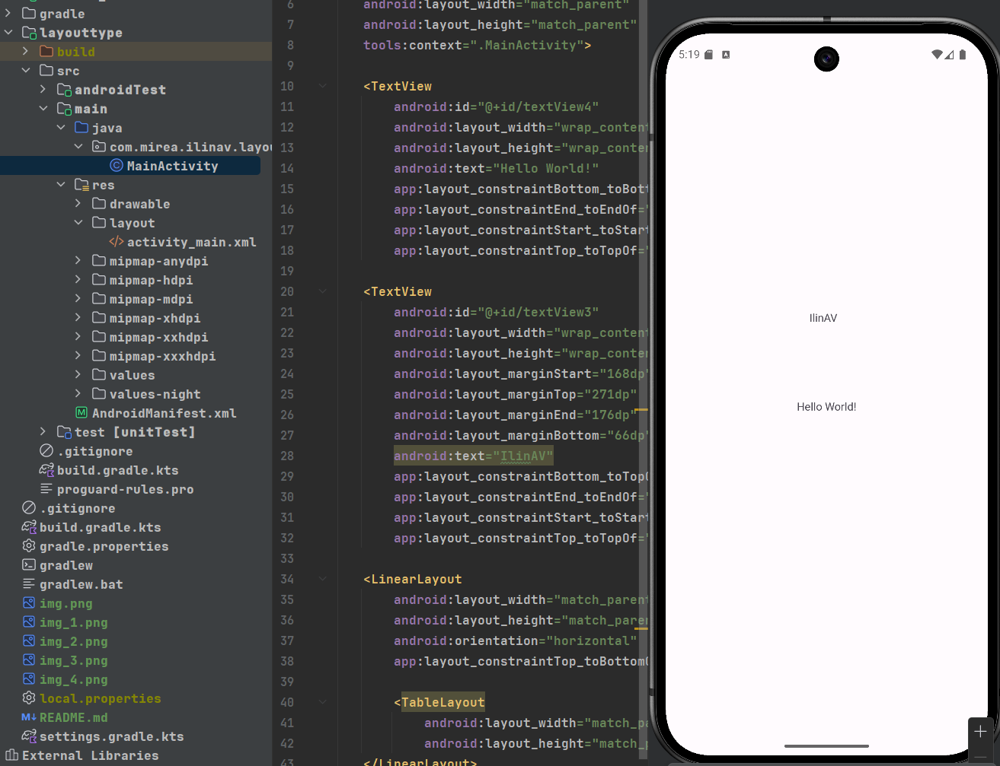
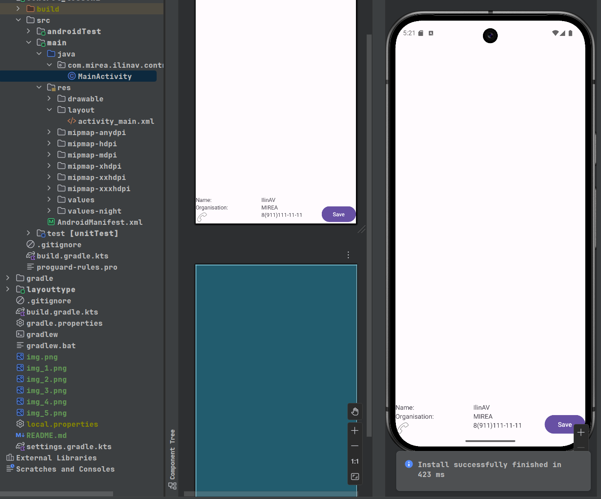
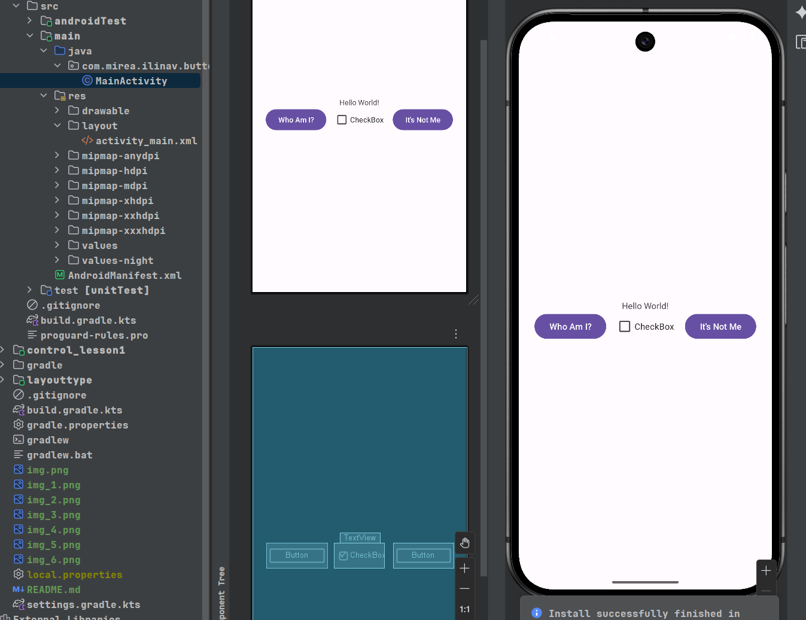
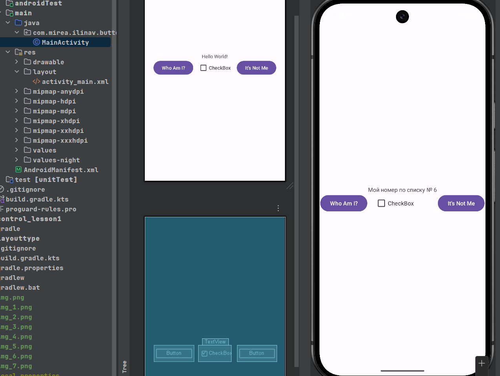
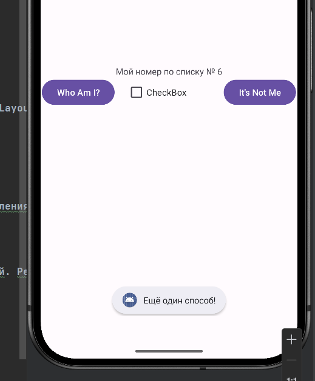

# Разработка мобильных компонент анализа безопасности информационно-аналитических систем

**Студент:** Ильин Артём Вадимович
**Группа:** БИСО-02-21

**Практическая работа №1**

## Созданные модули проекта

Создано 4 модуля для разных заданий практики. Каждый модуль - отдельное приложение со своей структурой.

## Модуль app
Базовый модуль созданный автоматически.

В модуле app в процессе выполнения практической работы были созадны файлы:
- activity_main.xml

- activity_second.xml

- linear_layout.xml

- table_layout.xml

## Модуль layouttype

Содержит примеры LinearLayout, TableLayout.

## Модуль control_lesson1

Модуль для работы с элементами управления. Добавлены TextView, EditText, Button, CheckBox, ImageView.

## Модуль buttonclicker
Модуль для изучения обработки событий. Реализованы обработчики нажатий для кнопок.

Запуск приложения

Нажатие на кнопку *Who Am I?*

Нажатие на кнопку *It's Not Me*

