# Разработка мобильных компонент анализа безопасности информационно-аналитических систем

**Студент:** Ильин Артём Вадимович

**Группа:** БИСО-02-21

**Практическая работа №2**

### Созданные модули проекта

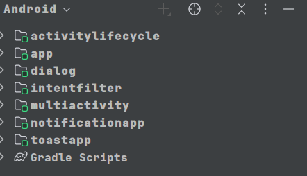

### Модуль activitylifecycle

Изучение жизненного цикла Activity с переопределением основных методов и логированием.

Код жизненного цикла

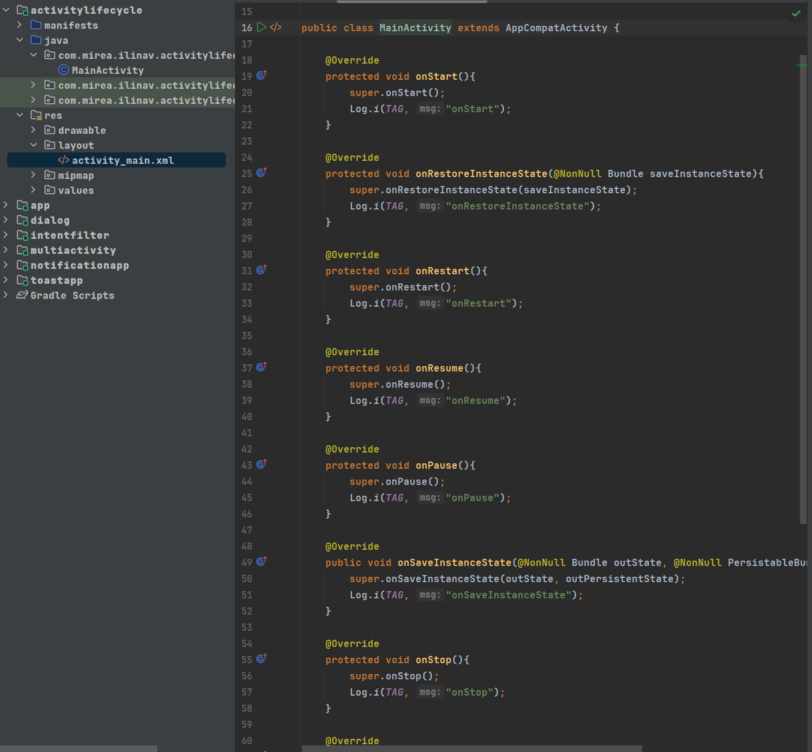

Демонстрация логирования

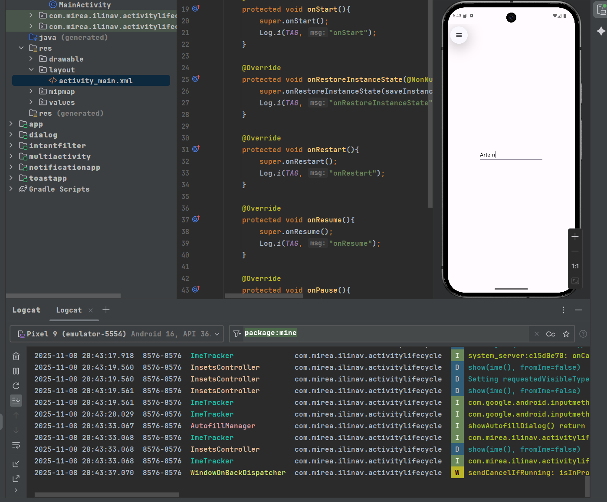

### Модуль multiactivity

Реализация многоконного приложения для перехода между Activity.

Главный экран multiactivity

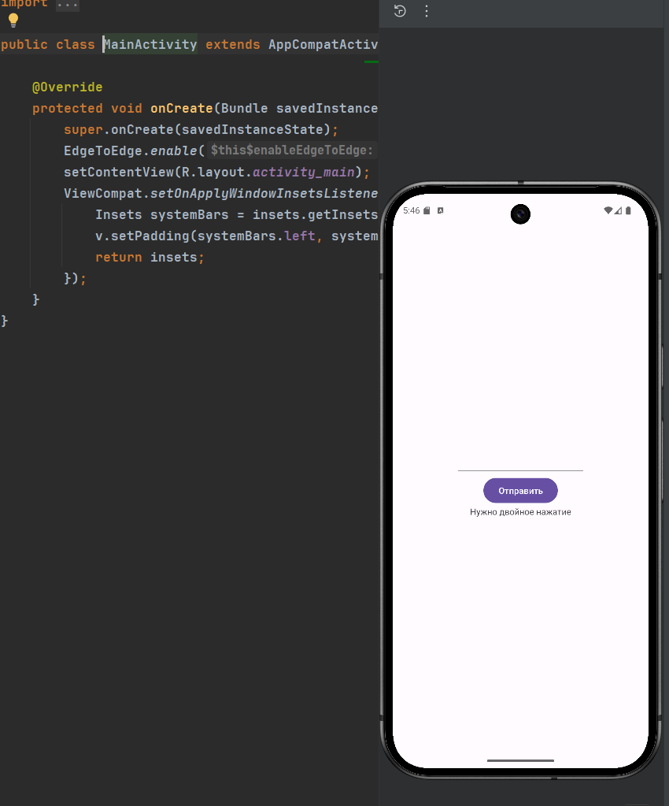

### Модуль intentfilter

Работа с неявными Intent для взаимодействия с другими приложениями системы.

Код и запуск активности

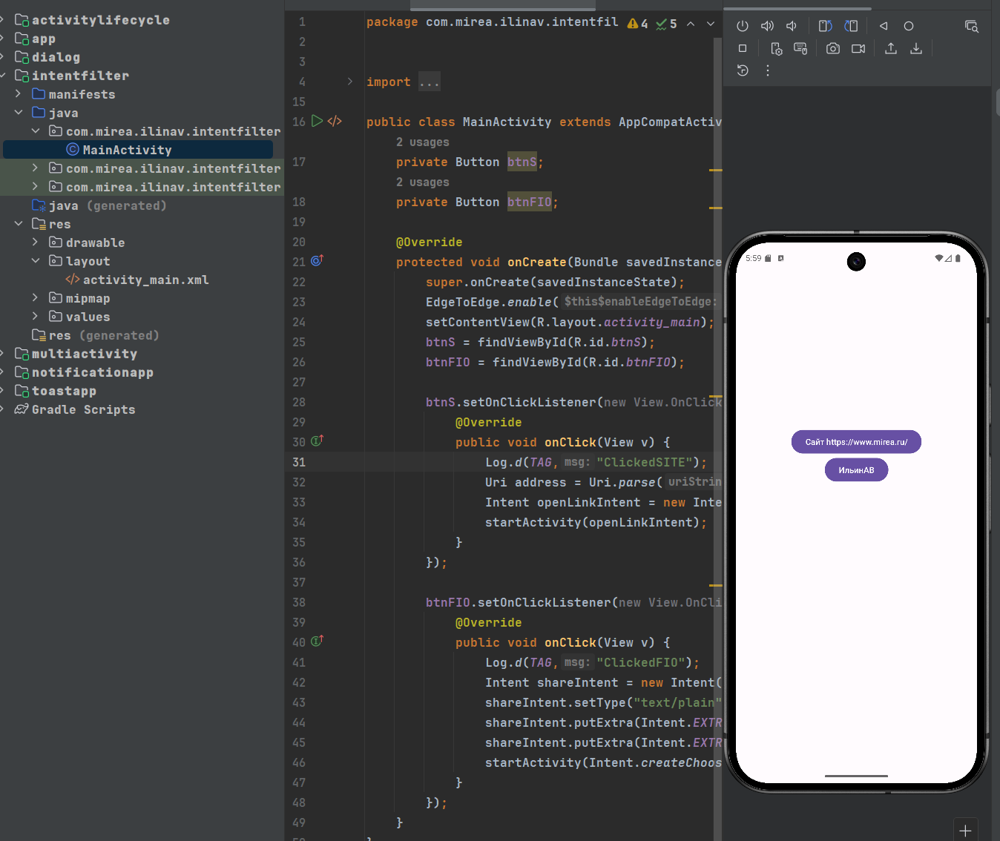

Демонстрация перехода на сайт по нажатию кнопки

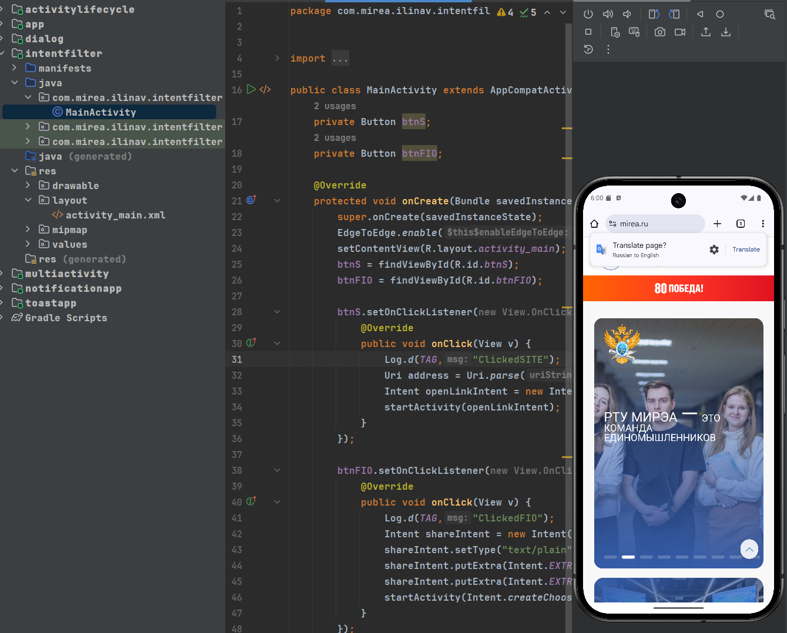

### Модуль toastapp

Реализация всплывающих уведомлений Toast с подсчетом символов.

Демонстрация работы

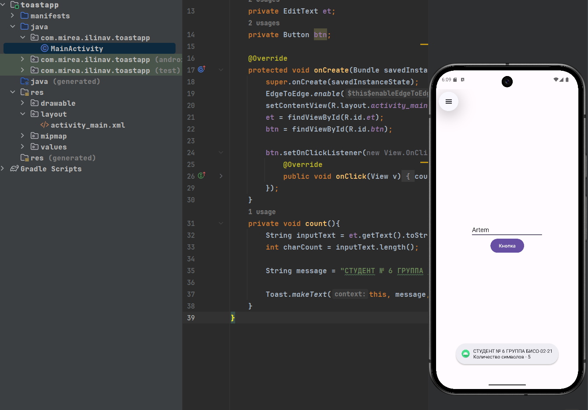

### Модуль notificationapp

Создание и управление уведомлениями в системе Android.

Приложение с кнопкой

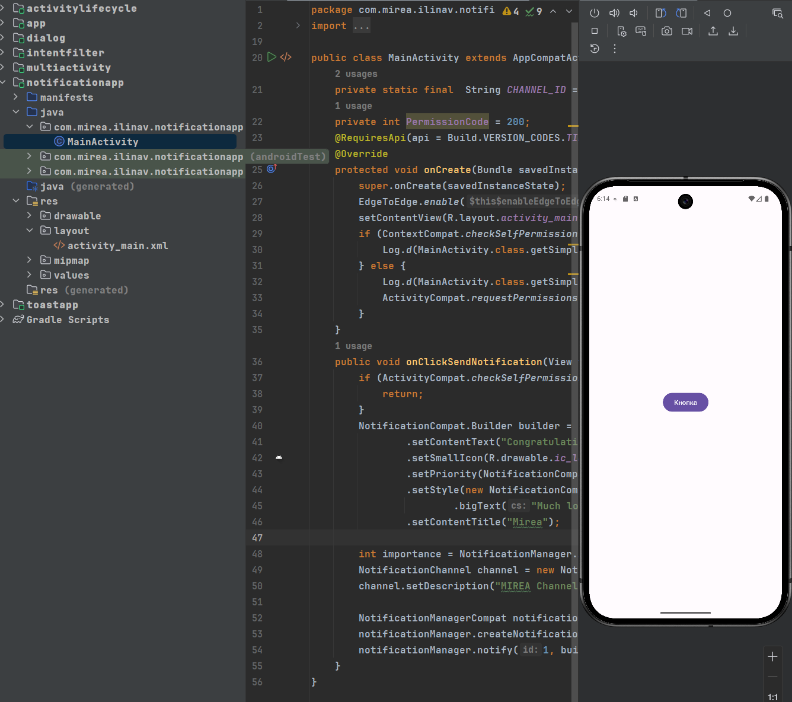

Демонстрация получения уведомления по нажатию кнопки

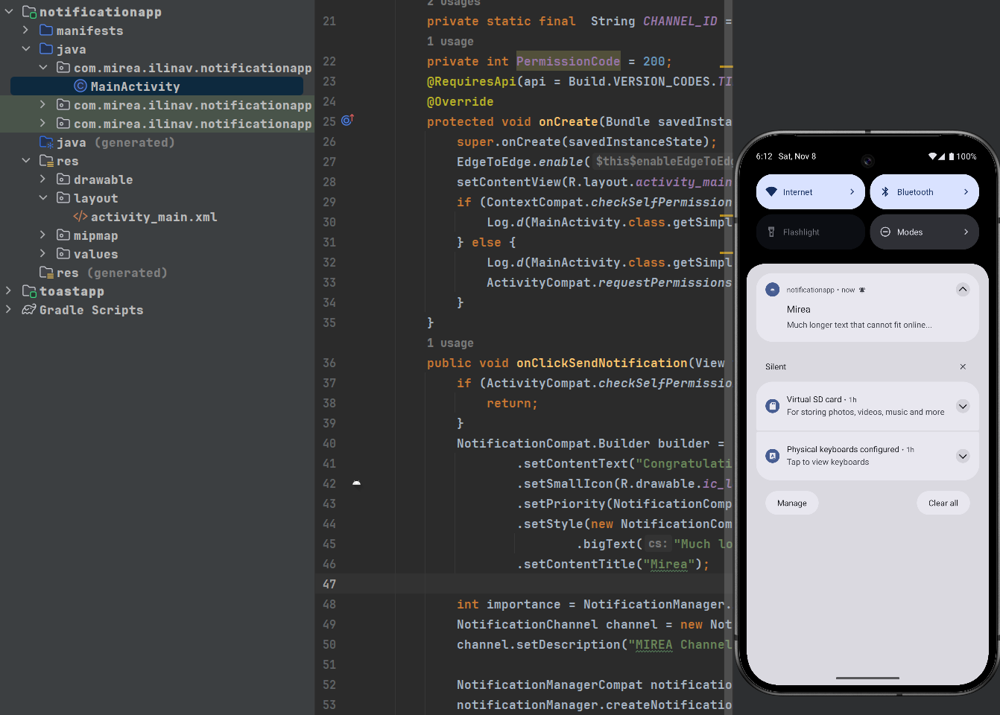

### Модуль dialog

Работа с диалоговыми окнами через DialogFragment.

Запуск приложения 

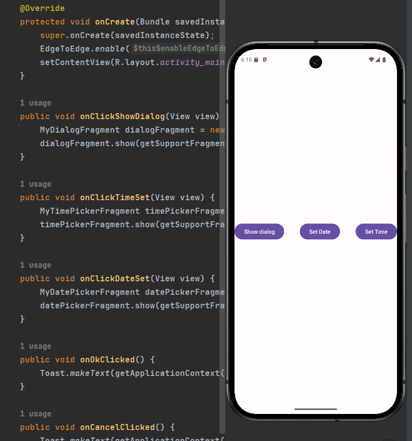

Демонстрация нажатия на кнопку *Show dialog*

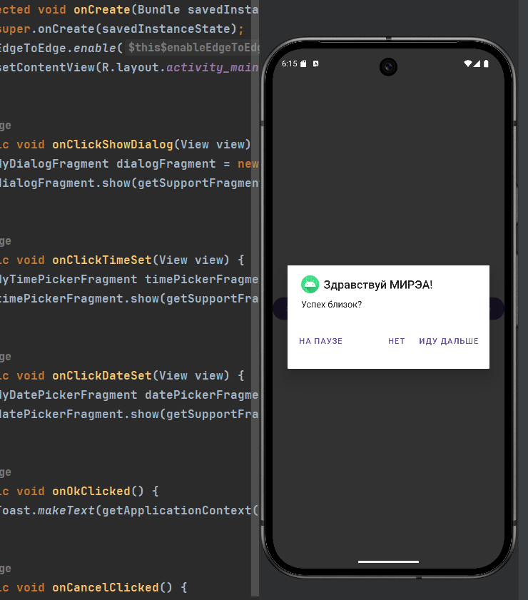

Устновка даты на кнопку *Set Date*

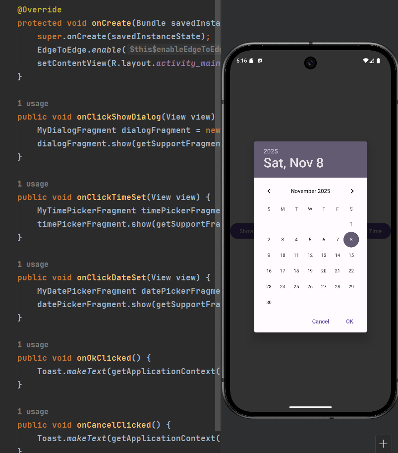

Установка времени на кнопку *Set Time*

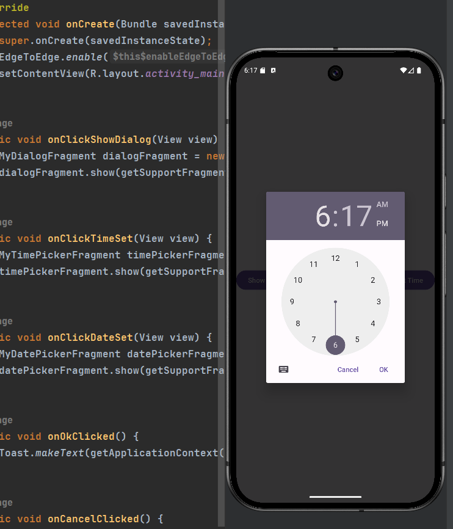