# Разработка мобильных компонент анализа безопасности информационно-аналитических систем

**Студент:** Ильин Артём Вадимович

**Группа:** БИСО-02-21

**Практическая работа №3**

### 1. Передача данных между Activity

Создано приложение с двумя активностями. При нажатии кнопки на главном экране происходит передача текущего системного времени и номера студента во вторую активность.

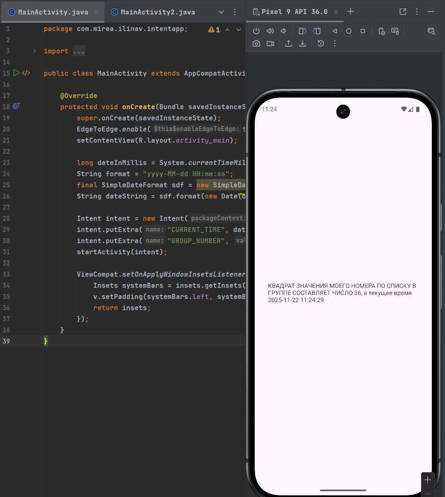

### 2. Вызов системных приложений

Приложение с тремя кнопками, каждая из которых запускает соответствующее системное приложение через неявные Intent.

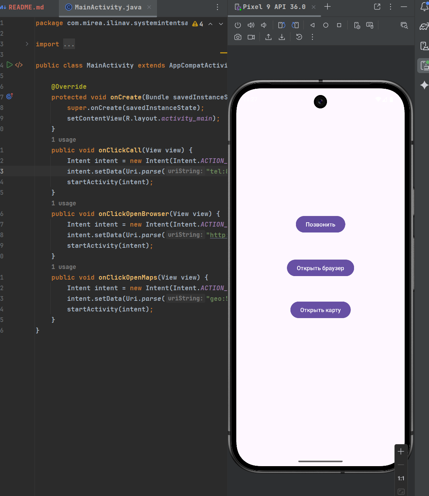

Главный экран содержит три кнопки: "Позвонить", "Открыть браузер", "Открыть карты". Каждая кнопка настроена на вызов системного приложения

При нажатии на копку **Позвонить**

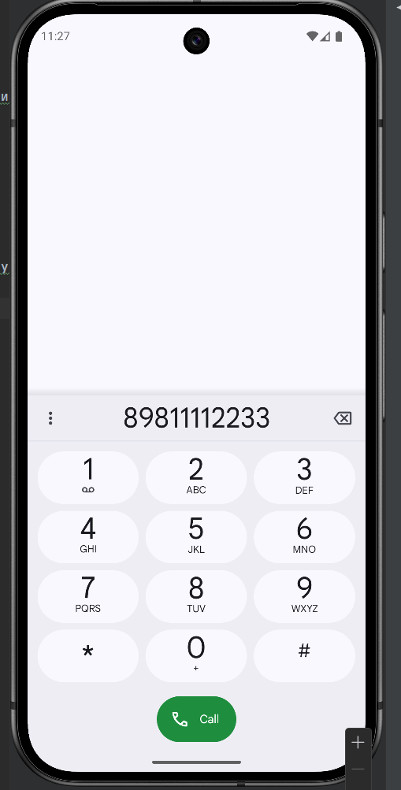

Открываются контакты с введным номером телефона

При нажатии на кнопку **Открыть браузер**

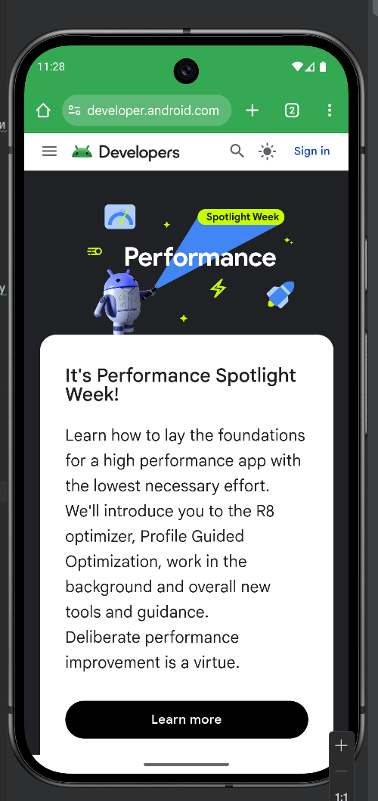

После выбора браузера открывается веб-страница developer.android.com. Intent с действием ACTION_VIEW и схемой http автоматически запускает браузер

При нажатии на кнопку **Открыть карту**

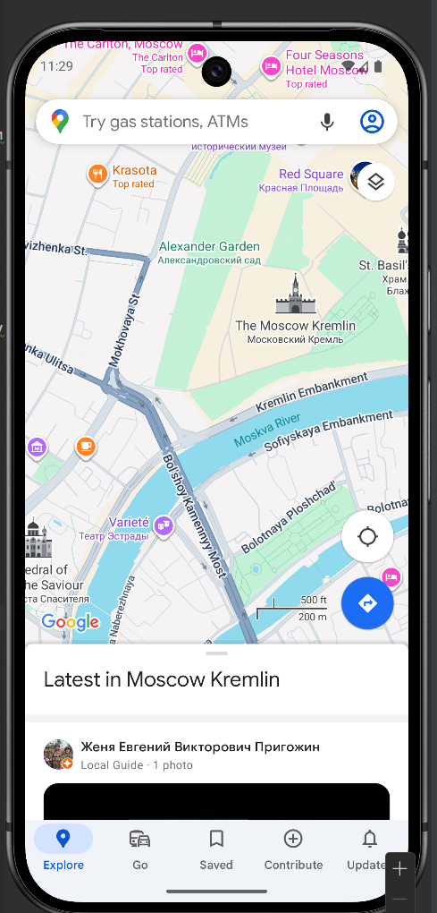

При выборе карт открывается приложение карт с центром в указанных координатах (55.749479,37.613944). Intent с схемой geo передает координаты картографическому приложению

### 3. Обмен данными с возвратом результата

Приложение FavoriteBook демонстрирует двустороннюю передачу данных между активностями с использованием Activity Result API.

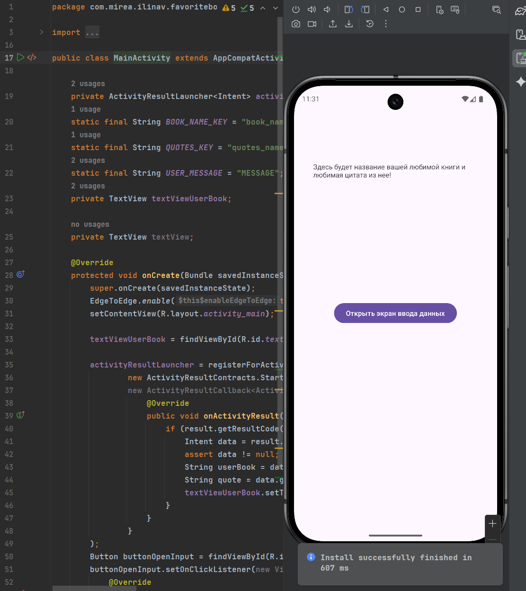

Изначально на главном экране отображается сообщение-заглушка. Кнопка "Открыть экран ввода данных" запускает вторую активность для ввода информации

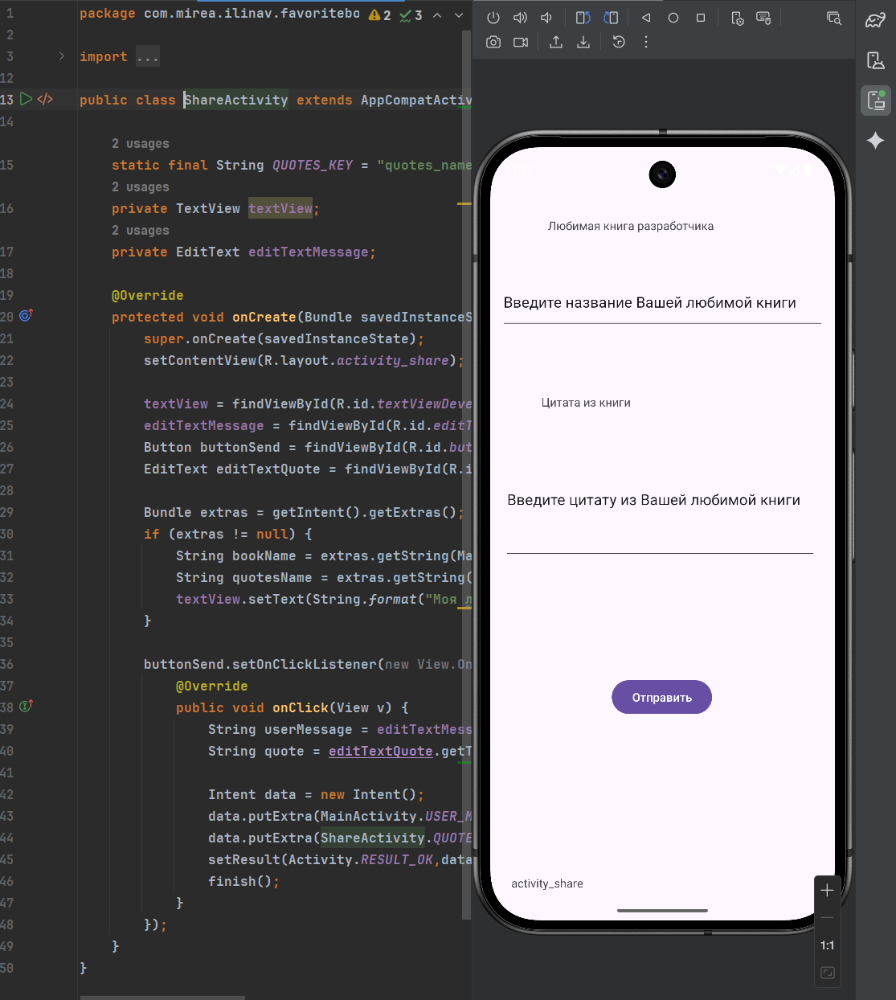

Вторая активность содержит два поля ввода: для названия книги и цитаты из нее

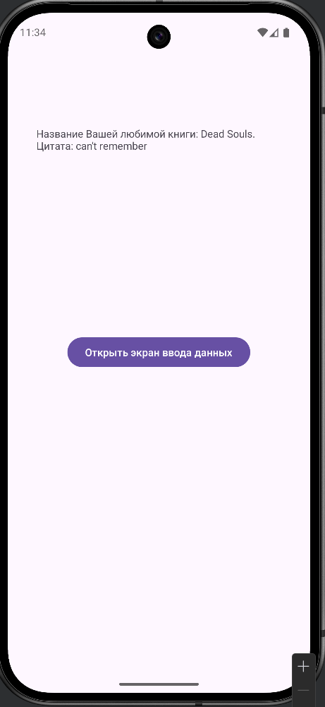

После нажатия кнопки отправки данные возвращаются в главную активность и отображаются вместо заглушки. Демонстрируется работа с setResult() и onActivityResult()

### 4. Динамические фрагменты

Приложение с динамической заменой фрагментов в контейнере и различным поведением в разных ориентациях экрана.

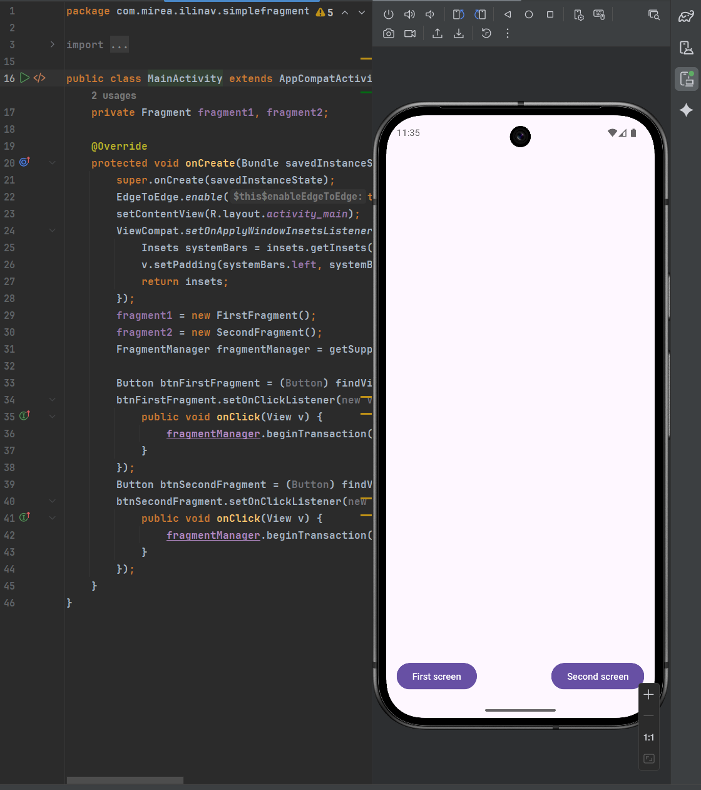

При запуске приложения отображаются две кнопки

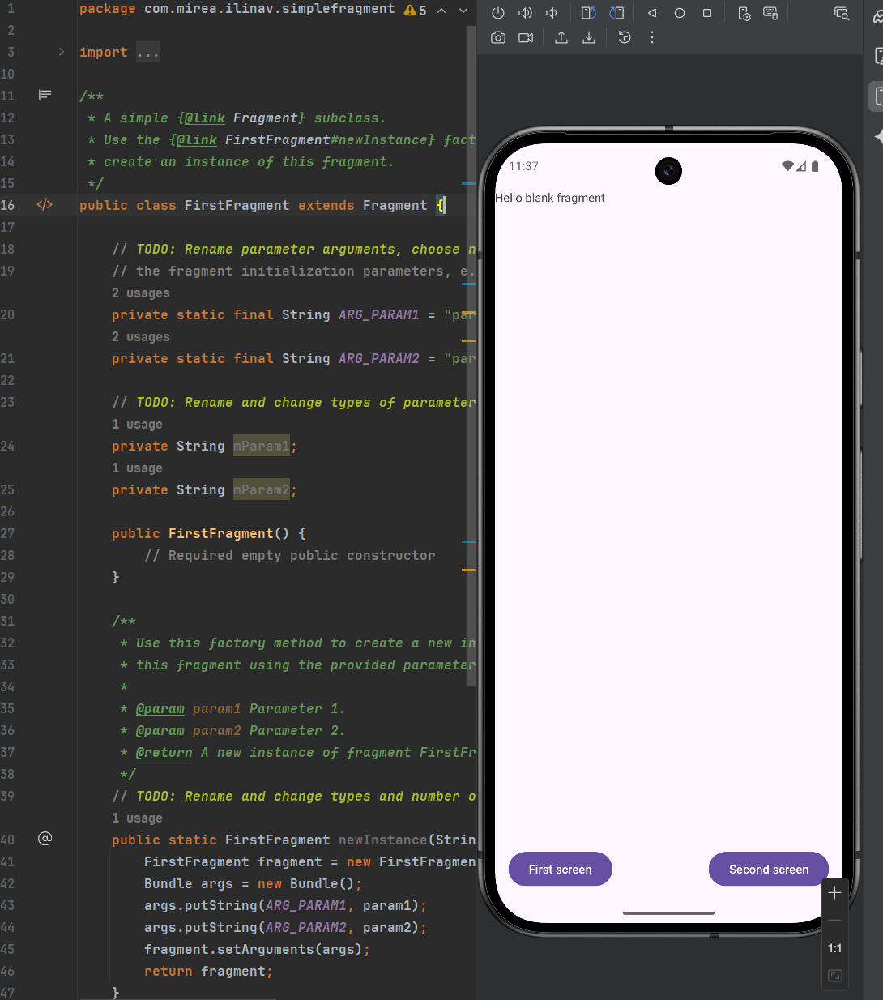

При нажатии "First screen" в контейнере отображается первый фрагмент

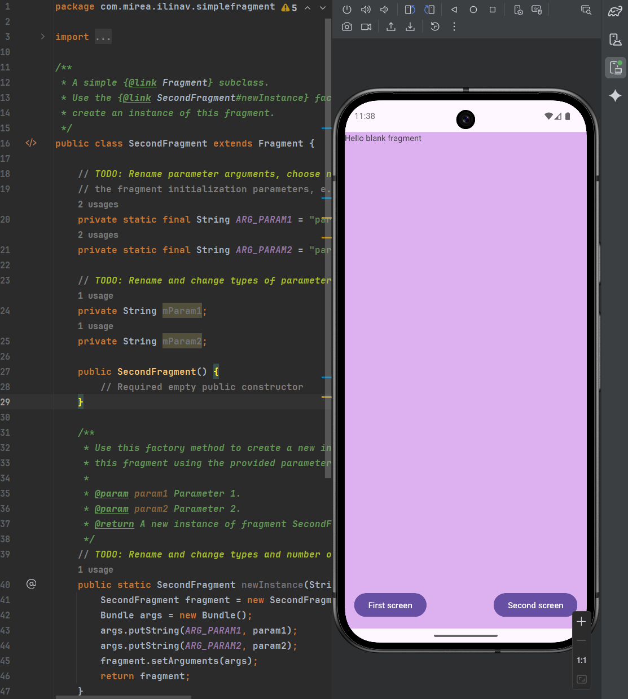

При нажатии "Second screen" происходит замена фрагмента в том же контейнере. Второй фрагмент имеет другой цвет фона
